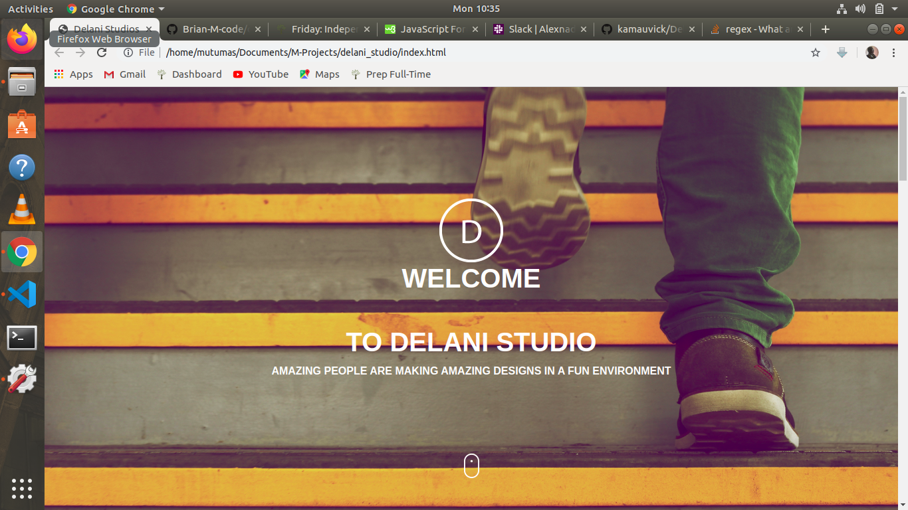

# Delani Studio.
- https://brian-m-code.github.io/delani-studio/

## Author:
- Brian Mutuma N.

### Description
This delani studio ia a site built to practice concepts learnt including JQuery, bootstrap, javascript and working with APIS's.

### Screenshot.

### Technologies used.
- HTML5
- Jquery -3.4.1
- CSS
- Javascript
- Bootstrap

# BDD
|Inputs  | Description                             |
|--------|-----------------------------------------|
|Name    | Enter your name to submit.              |
|Email   | Enter your mail.                        |
|Message | Type your message then click on submit. | 

## Bugs
The mail chimp doesn't work properly.

## License.
[The MIT license](license.md)
Copyright (c) Brian-M-Code @2019

